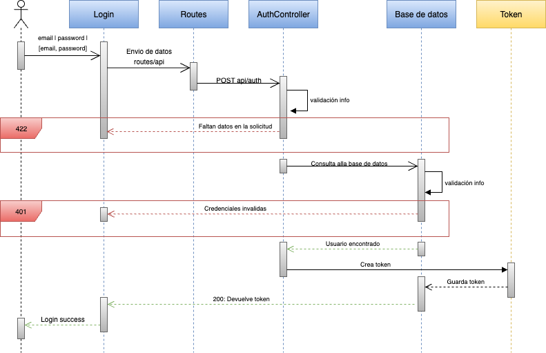

# 🍽️ Restaurant API - Frontend

Aplicación web para la gestión de restaurantes, desarrollada con **React**, **TypeScript** y **Vite**. Permite autenticación JWT, listado, creación, edición y eliminación de restaurantes mediante una API REST.

## 🚀 Despliegue en Vercel.com
- **URL:** https://restaurantsapi-front.vercel.app/

## ✨ Características

- 🔐 **Autenticación JWT** con login seguro
- 📋 **Gestión completa de restaurantes** (CRUD)
- 📊 **Tabla interactiva** con Material-UI DataGrid
- 🎭 **Modal para añadir/editar** restaurantes
- ❌ **Modal de confirmación** para eliminación segura
- ⚠️ **Manejo de errores** con validación de formularios
- ⏳ **Loading states** y feedback visual
- 📱 **Diseño responsive** con TailwindCSS
- 🔔 **Notificaciones** con react-toastify

## 🛠️ Tecnologías

- **React 18** con TypeScript
- **Vite** como bundler
- **TailwindCSS** para estilos
- **Material-UI** para componentes de tabla
- **React Modal** para ventanas modales
- **Axios** para peticiones HTTP
- **React Router DOM** para navegación
- **React Toastify** para notificaciones
- **React Icons** para iconografía

## 📊 Diagrama de Secuencia - Proceso de Autenticación



## 📁 Estructura del Proyecto
```

src/
├── main.tsx                               # Punto de entrada
├── App.tsx                                # Componente principal
├── index.css                              # Estilos globales
├── vite-env.d.ts                          # Types de Vite
│
├── api/
│   └── APIUtils.ts                        # Utilidades para API
│
├── assets/
│   └── react.svg                          # Logo de React
│
├── config/
│   ├── axios.config.ts                    # Configuración Axios
│   └── constants/
│       └── constants.ts                   # Constantes del proyecto
│
├── context/
│   ├── ComponentContext.tsx               # Context de componentes
│   ├── SearchContext.tsx                  # Context de búsqueda
│   └── SongContext.tsx                    # Context de canciones
│
├── modules/
│   ├── home/
│   │   ├── components/
│   │   │   ├── Content.tsx                # Contenido principal
│   │   │   ├── Explore.tsx                # Explorar canciones
│   │   │   ├── Footer.tsx                 # Pie de página
│   │   │   ├── Footer.css                 # Estilos footer
│   │   │   ├── Header.tsx                 # Cabecera
│   │   │   ├── Library.tsx                # Biblioteca favoritos
│   │   │   ├── Search.tsx                 # Búsqueda
│   │   │   ├── SideMenu.tsx               # Menú lateral
│   │   │   └── SideMenuMobile.tsx         # Menú móvil
│   │   ├── hooks/
│   │   │   ├── useContent.ts              # Hook contenido
│   │   │   ├── useExplore.ts              # Hook explorar
│   │   │   ├── useHeader.ts               # Hook cabecera
│   │   │   ├── useLibrary.ts              # Hook biblioteca
│   │   │   └── usePlaySong.ts             # Hook reproductor
│   │   ├── pages/
│   │   │   └── Home.tsx                   # Página principal
│   │   └── services/
│   │       ├── homeServices.ts            # Servicios home
│   │       └── musicServices.ts           # Servicios música
│   ├── login/
│   │   ├── components/
│   │   │   ├── FormField.tsx              # Campo formulario
│   │   │   └── Header.tsx                 # Cabecera login
│   │   ├── hooks/
│   │   │   └── useLogin.ts                # Hook login
│   │   ├── pages/
│   │   │   └── Login.tsx                  # Página login
│   │   └── services/
│   │       └── authService.ts             # Servicio autenticación
│   └── register/
│       ├── hooks/
│       │   └── useRegister.ts             # Hook registro
│       ├── pages/
│       │   └── Register.tsx               # Página registro
│       └── services/
│           └── regService.ts              # Servicio registro
│
└── types/
    └── types.d.ts                         # Definiciones de tipos
```
```
dmusic-back/
├── app/
│   ├── Http/
│   │   ├── Controllers/
│   │   │   ├── AuthController.php          # Login/Registro
│   │   │   ├── SongController.php          # Gestión canciones
│   │   │   └── ArtistController.php        # Gestión artistas
│   │   └── Middleware/
│   └── Models/
│       ├── User.php                        # Modelo usuario
│       ├── Song.php                        # Modelo canción
│       └── Artist.php                      # Modelo artista
├── routes/
│   └── api.php                            # Rutas de la API
├── database/
│   └── migrations/                        # Estructura BD
└── config/
    ├── database.php                       # Configuración MySQL
    └── sanctum.php                        # Configuración auth
```
```
src/
├── api/
│   └── APIUtils.ts          # Configuración de Axios y métodos HTTP
├── assets/
│   └── loading.gif          # Recursos estáticos
├── components/
│   ├── EditButtons.tsx      # Botones de editar/eliminar en tabla
│   ├── Footer.tsx           # Footer de la aplicación
│   ├── Header.tsx           # Cabecera de la aplicación
│   ├── LoginForm.tsx        # Formulario de login
│   ├── PageLoader/
│   │   └── index.tsx        # Componente de carga con spinner
│   ├── RestForm.tsx         # Formulario de restaurantes
│   ├── Table.tsx            # Tabla de restaurantes (DataGrid)
│   └── Modal/
│       └── RestaurantModal.tsx  # Modal para formularios
├── contexto/
│   ├── LoadContext.tsx      # Contexto para estados de carga y recargar datos
├── hooks/
│   ├── useErrors.ts         # Hook para manejo de errores
│   └── useModal.ts          # Hook para control de modales
├── pages/
│   ├── Home.tsx             # Página principal con tabla
│   ├── Login.tsx            # Página de login
│   ├── Unauthorized.tsx     # Página de acceso no autorizado
│   └── NotFound.tsx         # Página 404
├── types.d.ts               # Definiciones de TypeScript
├── App.tsx                  # Componente principal con rutas
├── main.tsx                 # Punto de entrada
├── index.css                # Estilos globales y TailwindCSS
└── vite-env.d.ts           # Tipos de Vite
```

## 🚀 Instalación

1. **Clona el repositorio**
   ```bash
   git clone https://github.com/donatomarino/restaurantsapi-front
   cd restaurantesapi-front
   ```

2. **Instala dependencias**
   ```bash
   npm install
   ```

3. **Configura las variables de entorno**
   ```env
   VITE_API_URL=http://localhost:800/api (CON BACK EN DOCKER)
   ```

4. **Inicia el servidor de desarrollo**
   ```bash
   npm run dev
   ```

5. **Accede a la aplicación**
   Abre [http://localhost:5173](http://localhost:5173) en tu navegador

## 📋 Scripts Disponibles

- `npm run dev` — Inicia el servidor de desarrollo
- `npm run build` — Compila la aplicación para producción
- `npm run preview` — Previsualiza la build de producción
- `npm run lint` — Ejecuta ESLint

## 🔑 Autenticación

### Credenciales de prueba
```
Email: donato@wewelcome.com
Password: wewelcome2025
```

### Flujo de autenticación
- **Login**: `POST /auth` con email y password
- **Token**: Se incluye automáticamente en las headers
- **Headers**: Se incluye Bearer token en todas las peticiones autenticadas
- **Logout**: Elimina el token del localStorage

## 📱 Funcionalidades

### 🏠 Página Principal
- Tabla interactiva con todos los restaurantes
- Búsqueda por campos (nombre, dirección, teléfono)
- Filtros por columnas con Material-UI DataGrid
- Paginación y ordenación
- Botones de acción (editar/eliminar)
- Botón para añadir nuevo restaurante

### ➕ Crear Restaurante
- Modal con formulario de creación
- Validación de campos obligatorios
- Feedback de éxito/error

### ✏️ Editar Restaurante
- Modal prellenado con datos existentes
- Validación de cambios
- Actualización en tiempo real
- Notificaciones toast** de confirmación

### 🗑️ Eliminar Restaurante
- Eliminación directa desde la tabla
- Eliminación segura con confirmación explícita
- Actualización automática

### 🔍 Búsqueda y Filtros
- Búsqueda global en tiempo real
- Filtros por columna individual
- Ordenación por cualquier campo
- Paginación configurable (5, 10 elementos)

## 📦 Dependencias Principales

- [React](https://react.dev/) - Framework principal
- [TypeScript](https://www.typescriptlang.org/) - Tipado estático
- [Vite](https://vitejs.dev/) - Build tool
- [TailwindCSS](https://tailwindcss.com/) - Estilos utilitarios
- [Material-UI](https://mui.com/) - Componentes de tabla
- [Axios](https://axios-http.com/) - Cliente HTTP
- [React Router DOM](https://reactrouter.com/) - Navegación
- [React Toastify](https://fkhadra.github.io/react-toastify/) - Notificaciones
- [React Modal](https://reactcommunity.org/react-modal/) - Ventanas modales

## 🔮 Próximas Mejoras

- **Actualización parcial (PATCH)**: Implementar endpoint PATCH para modificar campos específicos del restaurante sin necesidad de enviar todos los datos

## 👨‍💻 Autor

**Donato Marino**
